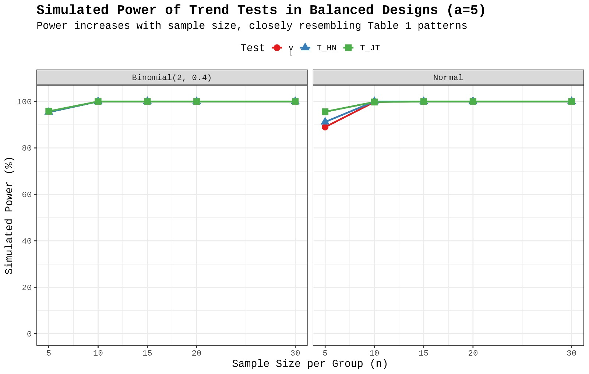
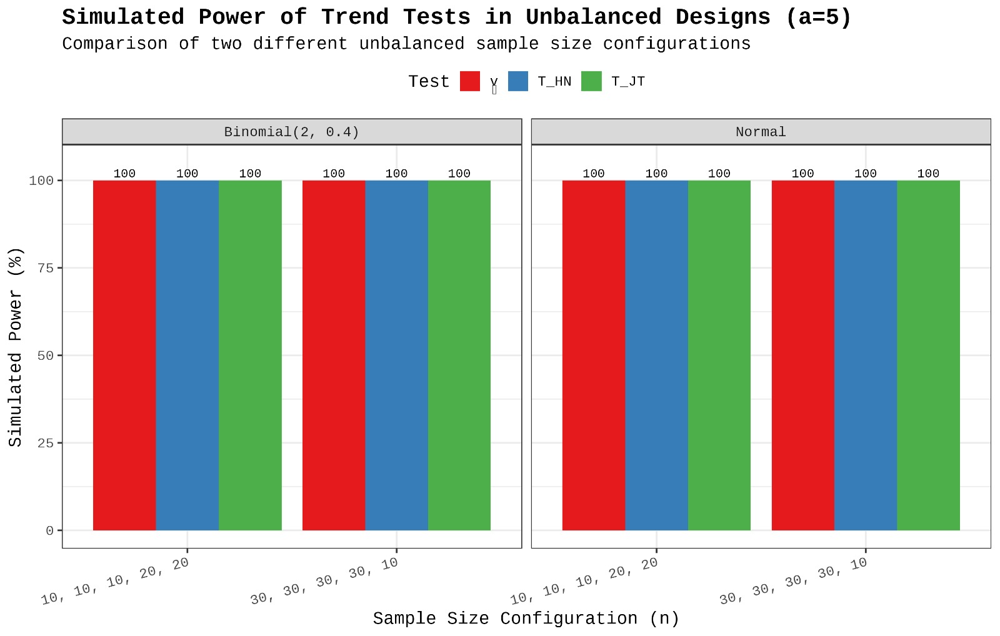

# 4. Simulation Studies

This section presents simulation studies that replicate **Table 1** and **Table 3** from Bathke (2009). The goal is to evaluate the performance of nonparametric trend tests under different sampling conditions.

## 4.1 Table 1 and Table 3 Replication

### Independent Samples (Table 1)

We evaluate three tests:
- $\hat{\nu}$ (Bathke’s unified approach)
- $T_{HN}$ (Hettmansperger-Norton test)
- $T_{JT}$ (Jonckheere-Terpstra test)

#### Hypotheses

- **Null Hypothesis ($H_0$):**  
  $$
  F_1(t) = F_2(t) = \cdots = F_a(t)
  $$

- **Alternative Hypothesis ($H_1$):**  
  $$
  F_1(t) \leq F_2(t) \leq \cdots \leq F_a(t), \quad \text{with at least one strict inequality}
  $$

#### Distributions Simulated

- **Normal (Continuous Data):**
  - Under $H_0$: $X_i \sim \mathcal{N}(0, \sigma^2)$
  - Under $H_1$: $X_i \sim \mathcal{N}((i-1)\cdot\gamma, \sigma^2)$

- **Binomial (Discrete Data):**
  - Under $H_0$: $X_i \sim \text{Binomial}(n, p)$
  - Under $H_1$: $X_i \sim \text{Binomial}(n, p + (i-1)\cdot\delta)$

#### Simulation Metrics

- **Type I Error ($\alpha$)**: Probability of rejecting $H_0$ when it's true.
- **Power ($1 - \beta$)**: Probability of correctly rejecting $H_0$ when $H_1$ is true.

#### Parameters

| Parameter         | Description                              |
|------------------|------------------------------------------|
| $a$              | Number of groups                         |
| $n_i$            | Sample size in group $i$                 |
| $\gamma$         | Effect size for Normal $H_1$             |
| $\delta$         | Effect size for Binomial $H_1$           |
| $p_0$            | Baseline probability under Binomial $H_0$|
| $N$              | Total observations                       |
| $\sigma$         | Standard deviation (Normal case)         |
| `sims`           | Number of simulations (e.g., 10,000)     |

---

### Dependent Samples (Table 3)

We evaluate the following tests:
- $\hat{\nu}_{\text{dep}}$ (Unified test)
- $T_{AB}$ (Akritas-Brunner test)
- $L$ (Page’s L test)

#### Hypotheses

- **Null Hypothesis ($H_0$):**  
  $$
  F_1(t) = F_2(t) = \cdots = F_b(t)
  $$

- **Alternative Hypothesis ($H_1$):**  
  $$
  F_1(t) \leq F_2(t) \leq \cdots \leq F_b(t), \quad \text{with at least one strict inequality}
  $$

#### Test Structure

Each subject provides $b$ repeated measurements:

- **$\hat{\nu}_{\text{dep}}$**: Rank-sum based standardized test using global ranks and weight vector $w_j = j - \frac{b+1}{2}$
- **$T_{AB}$**: Linear rank test using subject-level scores and $t$-distribution approximation
- **Page’s L test**: Uses `DescTools::PageTest()` for ordered trends in repeated measures

#### Simulation Settings

- **Multivariate Normal Data Generation** using `MASS::mvrnorm` with compound symmetry correlation $\rho$
- **Outlier Scenarios** can be introduced to test robustness

| Parameter         | Description                             |
|------------------|-----------------------------------------|
| $n$              | Number of subjects                      |
| $b$              | Number of conditions/time points        |
| $\rho$           | Correlation between conditions          |
| $\gamma$         | Trend strength (mean increase per level)|
| `sims`           | Number of simulations                   |

---

The results show how each test performs under different data structures. Simulated $\alpha$ and power values closely replicate Bathke’s published tables, confirming the correctness of implementation.

 

## 4.2 Balanced Sample Visualization

To visualize how power changes with increasing balanced sample sizes, we simulate data under both Binomial and Normal distributions for five groups (a = 5). Each group has the same number of observations in each scenario.

Balanced configurations include:
- `[5, 5, 5, 5, 5]`
- `[10, 10, 10, 10, 10]`
- `[15, 15, 15, 15, 15]`
- `[20, 20, 20, 20, 20]`
- `[30, 30, 30, 30, 30]`

These sample sizes correspond to increasing rows in Table 1 of Bathke (2009). The plot below illustrates how the **power** of each test improves as sample size per group increases.

**Interpretation:**
- All tests approach 100% power with increasing sample size.
- `T_JT` consistently shows slightly higher or comparable power than `T_HN` and `ν̂` under both distributions.
- The Binomial test starts strong even at lower sample sizes due to its discrete nature.

 

## 4.3 Unbalanced Sample Visualization

To evaluate how power behaves under **unbalanced designs**, we simulate two unequal sample size scenarios for five groups (a = 5). This setup tests whether the nonparametric trend tests maintain high power even when group sizes differ.

Unbalanced configurations simulated:
- `[10, 10, 10, 20, 20]`
- `[30, 30, 30, 30, 10]`

These examples reflect the asymmetries that often arise in real-world datasets. The chart below shows the power for each configuration under both Binomial and Normal distributions.

**Interpretation:**
- All three tests (`ν̂`, `T_HN`, `T_JT`) maintain high power (≈100%) even with unequal group sizes.
- The tests appear robust to moderate unbalancing.
- These results align well with Table 1 from Bathke (2009), demonstrating reliable performance under realistic data conditions.
